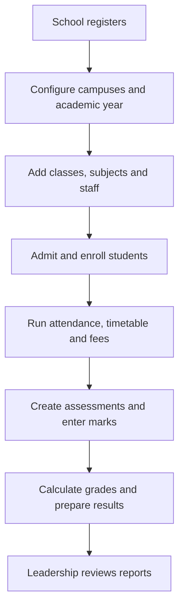
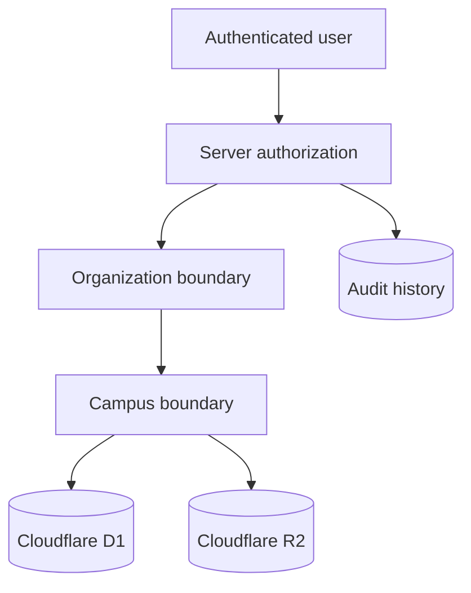
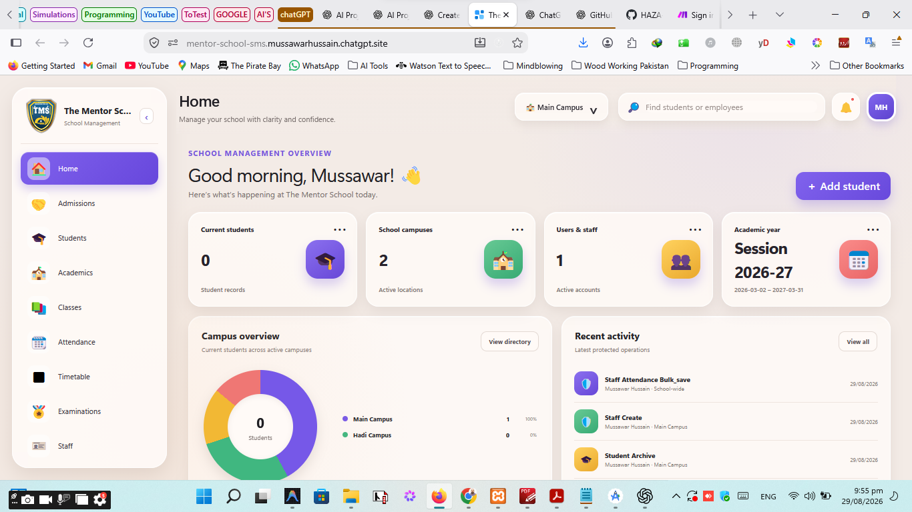
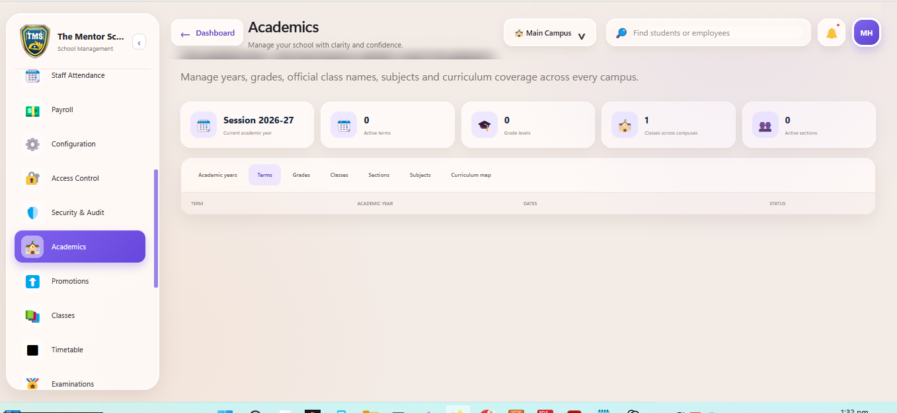
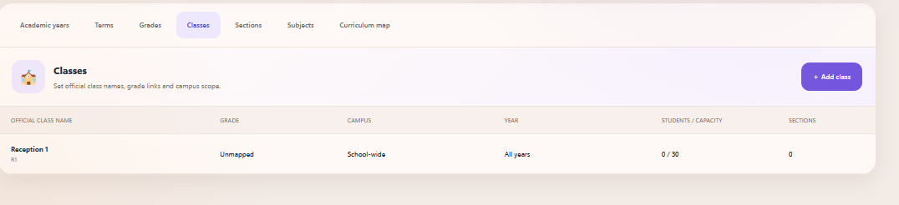
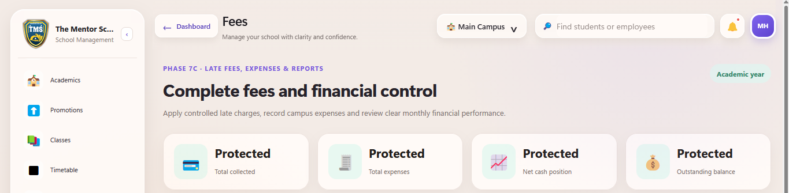
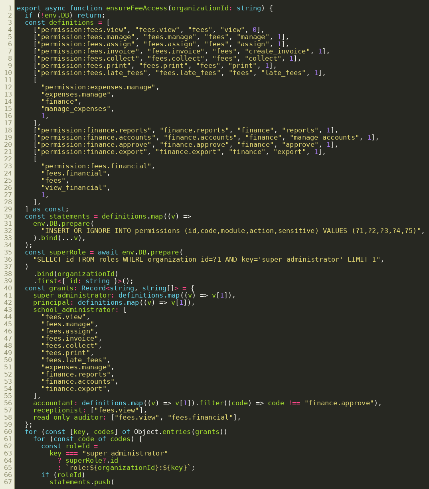
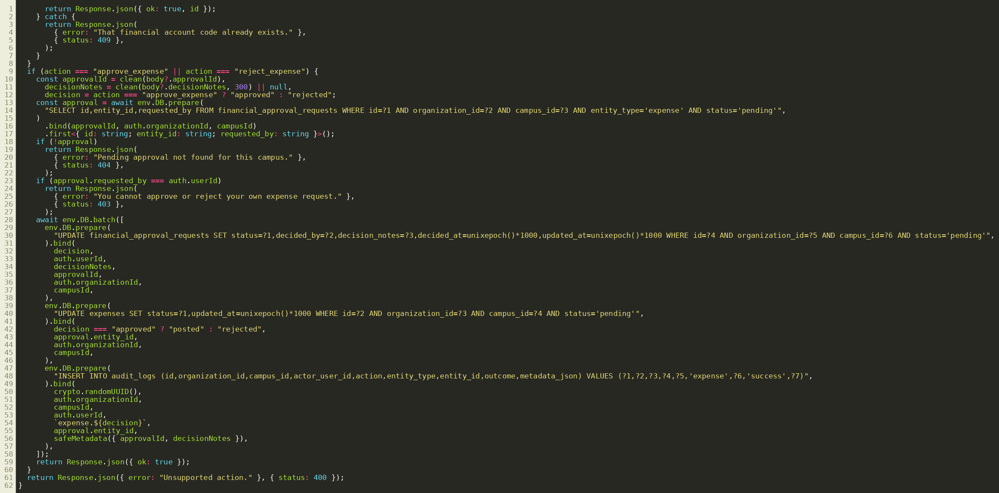

# HAZA-SMS

[](https://mentor-school-sms.mussawarhussain.chatgpt.site/)


HAZA-SMS is a multi-tenant School Management System for independent schools and school groups. Each registered school receives an isolated workspace, may operate multiple campuses, and sees only its own academic, operational, staff, student and financial records.

**Live application:** [The Mentor School SMS](https://mentor-school-sms.mussawarhussain.chatgpt.site/)

## A school operating system, not just a dashboard

HAZA-SMS is being built as a dependable operating layer for real schools: one secure account can manage an organization with multiple campuses, while every campus retains its own students, staff, timetable and operational records. School leadership can see an organization-wide picture without weakening campus or tenant boundaries.

The project combines polished day-to-day workflows with infrastructure that is usually postponed until much later: database migrations, granular permissions, audit history, isolation tests, durable document storage and approval controls. That combination is the core ambition of HAZA-SMS.

## Platform at a glance

| Area                | What HAZA-SMS delivers                                                                      |
| ------------------- | ------------------------------------------------------------------------------------------- |
| Identity & tenancy  | School registration, verified users, organization context and multi-campus access           |
| Student information | Profiles, guardians, documents, enrollment history, archive/restore and validated bulk data |
| Admissions          | Enquiries through approval, fee assignment, student conversion, letters and printable forms |
| Workforce           | Staff profiles, teacher allocations, attendance, leave, salary and payroll foundations      |
| Academics           | Years, terms, grades, classes, sections, subjects, curriculum and promotions                |
| Scheduling          | Seasonal timings, periods, class/teacher timetables, conflicts, substitutions and events    |
| Finance             | Fee plans, concessions, invoices, receipts, late fees, expenses, accounts and approvals     |
| Examinations        | Examination types, assessments, grading schemes, grade bands and examination timetable      |
| Governance          | Role-based authorization, tenant/campus isolation, audit logs, backups and exports          |

## How HAZA-SMS works

HAZA-SMS follows the same journey as a real school. A school registers once, creates its campuses and academic structure, admits students, assigns teachers, runs daily operations, collects fees and produces results. The system keeps every step connected, so information entered once is reused safely throughout the school.



### A simple operating scenario

Imagine that **Green Valley School** has a Main Campus and a Junior Campus:

1. The school administrator signs in and selects **Main Campus** from the campus menu.
2. In **Academics**, the administrator creates the academic year, terms, classes, sections and subjects.
3. In **Staff**, teachers are added and assigned to the classes and subjects they teach.
4. In **Admissions**, an application is reviewed and approved. HAZA-SMS creates the student profile and active enrollment without re-entering the same information.
5. Teachers use **Attendance** and **Timetable** only for their assigned work.
6. The accountant assigns a fee structure, generates the monthly invoice and records payment. The receipt is immediately printable.
7. The examination officer creates an examination type, grading scheme and assessment.
8. The assigned teacher opens **Examinations → Marks entry**, selects the assessment, enters marks or marks a student absent, and adds a short teacher remark.
9. HAZA-SMS calculates each percentage, grade, grade point and pass status from the school’s configured rules.
10. The principal can review reports for one campus or the whole organization, while another registered school can never see Green Valley School’s information.

### Which area should I open?

| I want to…                     | Open…                      | What happens next                                                       |
| ------------------------------ | -------------------------- | ----------------------------------------------------------------------- |
| Register or configure a school | Configuration              | Add school details, campuses, academic years and institutional settings |
| Admit a child                  | Admissions                 | Move from enquiry to application, approval, fee package and enrollment  |
| Find or update a learner       | Students                   | Open the profile, family, documents and enrollment history              |
| Set up teaching                | Academics / Staff          | Create the structure, subjects and teacher assignments                  |
| Record who attended            | Attendance                 | Choose the date and class, then mark the loaded student roster          |
| Build the weekly schedule      | Timetable                  | Configure timings and assign class, teacher, subject and room periods   |
| Collect school fees            | Fees                       | Assign fees, create invoices, receive payment and print receipts        |
| Prepare examinations           | Examinations               | Define types, grading rules, assessments and examination schedules      |
| Enter student marks            | Examinations → Marks entry | Choose an assessment, complete the roster and save calculated results   |
| Check accountability           | Security & Audit           | Review protected actions, actors, outcomes and backup history           |

> **Important:** changing the selected campus changes the operational data shown on the dashboard. Organization-wide users may review multiple campuses; campus-scoped users only see campuses assigned to them. Permissions are checked again on the server whenever data is viewed or changed.

## Current capabilities

- School registration, verified identity and organization selection
- Multi-school and multi-campus data isolation
- Server-enforced roles and granular permissions
- School, campus and academic-year configuration
- Audit history, security controls and backup foundation
- Student directory, complete profiles, guardians, documents and enrollment history
- Bulk student import/export and validation
- Admission enquiry, application, assessment, approval and enrollment conversion
- Printable admission forms, admission letters and reporting
- Staff profiles, photographs, documents, qualifications and experience
- Teacher subject, class and class-teacher assignments
- Staff attendance, leave management, salary configuration and payroll foundation
- Academic years, terms, grade levels, classes, sections, subjects and curriculum mapping
- Promotion rules and enrollment-history integration
- Daily student attendance, correction requests, reports and absence alerts
- Seasonal school schedules, period definitions and class timetables
- Teacher timetables, workload summaries, conflict detection and substitutions
- Examination timetables, invigilator and room conflict checks, and school events calendar
- Fee categories, class/campus fee structures, concessions and student fee assignments
- Monthly invoices, outstanding balances, payment collection and printable fee receipts
- Campus-aware late-fee rules, expense tracking and monthly financial reports
- Cash and bank account summaries, independent expense approvals and CSV/print exports
- Reusable examination types, class assessments and academic-year grading schemes
- Validated, non-overlapping grade boundaries with pass/fail and grade-point configuration
- Roster-based marks entry, absence handling, automatic percentage/grade calculation and teacher remarks

## Security architecture



The browser never decides whether an operation is allowed. Every protected request is re-authorized on the server, bound to the active organization and—where applicable—the selected campus. Linked academic records are validated against that same scope before a write is accepted.

## Architecture

| Layer           | Technology                                   | Responsibility                                        |
| --------------- | -------------------------------------------- | ----------------------------------------------------- |
| Application     | React, Vinext, TypeScript                    | Server-rendered dashboard and protected workflows     |
| Styling         | Tailwind-compatible CSS and component styles | Responsive school administration interface            |
| Runtime         | Cloudflare Workers                           | API routes and server-side authorization              |
| Structured data | Cloudflare D1 + Drizzle                      | Tenant records, migrations and indexes                |
| File storage    | Cloudflare R2                                | Student/staff photos, documents and generated records |
| Identity        | Sign in with ChatGPT temporarily             | Verified user identity during development             |
| Authorization   | Application RBAC                             | Permission and campus checks on protected operations  |
| History         | D1 audit logs                                | Records sensitive views and data changes              |

## Multi-tenant security model

Every protected record is scoped by `organization_id`. Campus-specific records are additionally scoped by `campus_id`. API routes resolve the authenticated user’s active organization and campus, verify permissions server-side, and reject cross-tenant or unauthorized campus access. Sidebar visibility is only a convenience; it is not the security boundary.

Key controls include:

- Organization and campus ownership checks
- Server-side permission checks for view, create, edit, approve, export and sensitive-data actions
- Same-origin validation and rate limiting for writes
- Audited high-value actions
- Tenant-scoped D1 queries and R2 object paths
- Version-controlled migrations and indexed query paths
- Backup manifests restricted to one organization

## Timetable system

- Winter and summer schedules per campus
- Configurable school hours, breaks and working days
- Teaching-period definitions
- Class, section, subject, teacher and room assignments
- Individual teacher weekly timetables
- Teacher workload and free-period summaries
- Teacher, class and room conflict prevention
- Temporary substitute-teacher scheduling
- Campus, academic-year and schedule isolation
- Audit history for timetable changes

## Examination and grading foundation

- Reusable written, oral, practical, project and mixed assessment types
- Default weightage and result-approval requirements per type
- Campus-specific assessments linked to year, term, class, section and subject
- Maximum marks, passing marks and assessment weightage validation
- Academic-year or organization-wide grading schemes
- Percentage bands, grade points, remarks and passing-status rules
- Overlap prevention for grading ranges
- Existing examination timetable, rooms, invigilators and events retained
- Audit entries for type, assessment, scheme and boundary creation
- Marks rosters generated from active enrollment records
- Assigned-teacher checks before marks can be saved
- Automatic percentage, grade, grade-point and pass/fail calculation
- Student absence tracking and contextual teacher remarks
- Audited marks updates with organization and campus validation

## Repository structure

```text
app/                 Dashboard panels and protected API routes
db/                  Drizzle schema and D1 access helpers
drizzle/             Version-controlled D1 migrations
lib/                 Authorization, security and CSV helpers
public/              School logo and public assets
tests/               Render and security-boundary tests
worker/              Cloudflare Worker entry point
.openai/hosting.json Sites bindings for D1 and R2
```

## Local development

Requirements: Node.js 22.13 or later and npm.

```bash
npm ci
npm run dev
```

Useful commands:

```bash
npm test
npm run build
npm run db:generate
```

Do not commit `.env` files, credentials, production exports or student/staff documents.

## Database migrations

The `drizzle/` directory contains the ordered D1 schema history. New database work must use a new migration, be reviewed for tenant ownership and indexes, and pass testing before deployment. Never rewrite an already-deployed migration.

## Development workflow

1. Create a focused branch for the phase or fix.
2. Implement database, API, permission and interface layers together.
3. Add or update security-boundary tests.
4. Run the complete test suite.
5. Commit and update GitHub.
6. Merge the completed phase into `main`.
7. Publish and verify the Sites deployment.

## Screenshots

### School management dashboard



### Academic configuration



### Classes and grade mapping



### Fees and financial control



### Server-side finance permissions



### Financial approval enforcement



## Roadmap

| Milestone                                                                         | Status      |
| --------------------------------------------------------------------------------- | ----------- |
| Phase 0 — Secure multi-tenant foundation                                          | Complete    |
| Phase 1 — Student information system                                              | Complete    |
| Phase 2 — Admissions management                                                   | Complete    |
| Phase 3 — Staff and payroll foundation                                            | Complete    |
| Phase 4 — Academic structure and tenant isolation                                 | Complete    |
| Phase 5 — Attendance foundation                                                   | Complete    |
| Phase 6 — Timetables, substitutions and events                                    | Complete    |
| Phase 7 — Fees and financial controls                                             | Complete    |
| Phase 8 — Examinations and results                                                | In progress |
| Phases 9–14 — Learning, communication, portals, operations, analytics and rollout | Planned     |

The next product milestone expands Phase 8 into secure marks entry, result calculation, teacher remarks, approval and publication. Later phases add learning resources, communications, parent/student portals and role-aware analytics without replacing the foundations already built.

## The long-term vision

HAZA-SMS aims to give an independent school the operational depth of a large enterprise platform without losing clarity. The result should be a system where a receptionist can complete an admission, a teacher can manage an assigned class, an accountant can control collections, and a principal can approve and analyze school performance—with each person seeing exactly the information their role permits.

## License

This repository is licensed under the [MIT License](LICENSE).
